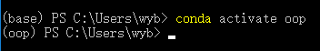
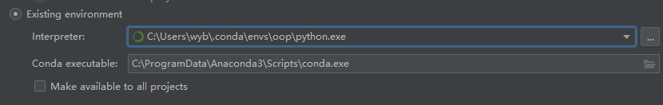

# OOP-Python 面向对象
- Python的面向对象
- 面向对象编程
  - 基础
  - 公有私有
  - 继承
  - 组合，Minxi
- 魔法函数
  - 魔法函数概述
  - 构造类魔法函数
  - 运算类魔法函数

# 1:面向对象概述
- OOP思想
  - 接触到任意一个任务，首先想到的是任务是这个世界的构成，是由模型构成的
- 几个名词
  - OO:面向对象
  - OOA：面向对象分析
  - OOD：面向对象设计
  - OOI：面向对象实现
  - OOP：面向对象编程
  - OOA -> OOD -> OOI ：面向对象的实现过程

- 类和对象的概念
  - 类：抽象名词，代表一个集合，共性的事物
  - 对象：具体的事物，单个个体
  - 类与对象的关系
    - 一个是具体的事物，代表一类事物的个体
    - 一个是抽象，代表一类事物
- 类中的事物，应该具有两个内容
  - 属性
  - 方法（函数）

# 2：类的基本实现
- 类的命名
  - 遵守变量名的规范
  - 大驼峰（多个单词构成，每个单词首字母大写）
  - 尽量避开跟系统命名相似的命名
- 如何声明一个类
  - 必须用class关键字
  - 类由属性和方法构成，其他不允许出现
  - 成员属性定义可以直接使用变量赋值，如果没有值，可以使用None
  - 案例 OOP_01.py
- 实例化类

          变量 = 类名（） # 实例化一个对象
- 访问对象成员
  - 使用 . 操作符

          obj.成员属性名称
          obj.成员方法
  - 可以通过默认内置变量检查类和对象的所有成员
    - 对象的所有成员检测

           # dict前后各有两个下划线
           obj._dict_
    - 类所有的成员

           # dict 前后各有两个下划线
# 3：补充anaconda
- anaconda主要是一个虚拟环境管理器
- 还是一个安装包管理器
- cmd :启动Anaconda Powershell Promat
- conda list:显示anaconda安装的包
- conda env list :显示anaconda的虚拟环境列表
- conda create -n xxx python=3.7 ：创建Python版本为3.7的anaconda虚拟环境
- conda  activate xxx ：激活创建的acaconda虚拟环境
- 
- conda deactivate
- 在Pycharm中切换虚拟环境:File -> Setting -> Project -> Project Interpreter -> add -> Conda Environment 选择已经存在的环境，教程是在Anaconda安装目录下的envs下面。
但是我的在这里
