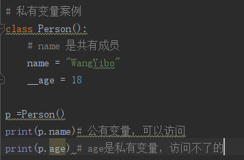
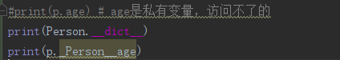
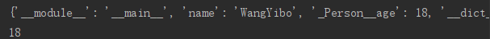

# OOP-Python 面向对象
- Python的面向对象
- 面向对象编程
  - 基础
  - 公有私有
  - 继承
  - 组合，Minxi
- 魔法函数
  - 魔法函数概述
  - 构造类魔法函数
  - 运算类魔法函数

# 1:面向对象概述
- OOP思想
  - 接触到任意一个任务，首先想到的是任务是这个世界的构成，是由模型构成的
- 几个名词
  - OO:面向对象
  - OOA：面向对象分析
  - OOD：面向对象设计
  - OOI：面向对象实现
  - OOP：面向对象编程
  - OOA -> OOD -> OOI ：面向对象的实现过程

- 类和对象的概念
  - 类：抽象名词，代表一个集合，共性的事物
  - 对象：具体的事物，单个个体
  - 类与对象的关系
    - 一个是具体的事物，代表一类事物的个体
    - 一个是抽象，代表一类事物
- 类中的事物，应该具有两个内容
  - 属性
  - 方法（函数）

# 2：类的基本实现
- 类的命名
  - 遵守变量名的规范
  - 大驼峰（多个单词构成，每个单词首字母大写）
  - 尽量避开跟系统命名相似的命名
- 如何声明一个类
  - 必须用class关键字
  - 类由属性和方法构成，其他不允许出现
  - 成员属性定义可以直接使用变量赋值，如果没有值，可以使用None
  - 案例 OOP_01.py
- 实例化类

          变量 = 类名（） # 实例化一个对象
- 访问对象成员
  - 使用 . 操作符

          obj.成员属性名称
          obj.成员方法
  - 可以通过默认内置变量检查类和对象的所有成员
    - 对象的所有成员检测

           # dict前后各有两个下划线
           obj._dict_
    - 类所有的成员

           # dict 前后各有两个下划线
# 3：补充anaconda
- anaconda主要是一个虚拟环境管理器
- 还是一个安装包管理器
- cmd :启动Anaconda Powershell Promat
- conda list:显示anaconda安装的包
- conda env list :显示anaconda的虚拟环境列表
- conda create -n xxx python=3.7 ：创建Python版本为3.7的anaconda虚拟环境
- conda  activate xxx ：激活创建的acaconda虚拟环境
- 
- conda deactivate
- 在Pycharm中切换虚拟环境:File -> Setting -> Project -> Project Interpreter -> add -> Conda Environment 选择已经存在的环境，教程是在Anaconda安装目录下的envs下面。
但是我的在这里

# 4：类与对象的成员分析
- 类和对象都可以存储成员，成员可以归类所有，也可以归对象所有
- 类存储成员时使用的是与类关联的一个对象。会有一个相应类对应的一个实例。
- 独享存储成员时存储在当前对象中。
- 对象访问一个成员的时候，如果对象中没有该成员，尝试访问类中的同名成员。如果对象中有此成员，则一定使用此成员
- 创建对象的时候，类中的成员不会放入对象当中，而是得到一个空对象，没有成员
- 通过对象对类中成员重新赋值或者通过对象添加成员时，对应成员会保存在对象中，而不会修改类成员

# 5：关于self
- self在对象的方法表示当前对象本身，如果通过对象调用一个方法，那么该对象会自动传入到当前方法的第一个参数中
- self并不是关键字，只是一个用于接受对象的普通参数，理论上可以使用任何一个普通变量名代替
- 方法中有self形参的方法称为非绑定类的方法，可以通过对象访问，没有self的是绑定类的方法，只能通过类来访问。
- 使用类访问绑定类的方法时候，如果类方法中需要访问当前类的成员，可以通过 __class__ 成员名来访问成员
# 6：面向对象三大特性
- 封装
- 继承
- 多态
## 6.1：封装
- 封装就是对对象的成员进行访问限制
- 封装的三个级别
  - 公开，public
  - 受保护的，protected
  - 私有的，private
  - public，private，protected 不是关键字
- 判别对象的位置
  - 对象内部
  - 对象外部
  - 子类中
- 私有
  - 私有成员时最高级别的封装，只有在当前类或者对象中访问
  - 在成员前面添加两个下划线即可

  - Python的私有不是真的私有，是一种成为name mangling的改名策略，可以使用对象名._classname_ attributename来访问
  
  
## 6.2：继承
- 继承就是一个类可以获得另外一个类中的成员属性和成员方法
- 作用：减少代码量，增加代码复用功能，同时可以设置类与类之间的关系
- 继承与被继承的概念：
  - 被继承的类叫做父类，也叫基类，也叫超类
  - 用于集成的类也叫子类，派生类
  - 继承与被继承一定存在一个 is - a 的关系
- 继承的语法（见代码）
```
class Person():
    name = "wyb"
    age = 0
    def sleep(self):
        print("Sleeping ....")

# 父类写在括号里面
class Teacher(Person):
    pass
t = Teacher()
print(t.name)  # 输出 ： wyb
```
- 继承的特征
  - 所有的类都继承自object两类，即所有的类都是object的类
  - 子类一旦继承父类，则可以使用父类中除私有成员外的所有内容，受保护的也可以
  - 子类继承父类后并没有将父类成员完全赋值到子类中，而是通过引用关系访问调用
  - 子类中可以定义独有的成员属性和方法
  - 子类中定义的成员和父类成员如果相同，则优先使用子类中的成员
  - 子类如果想扩充父类的方法，可以在定义新方法的同时访问父类成员来进行代码重用。可以使用 父类名.父类成员 的格式来调用父类成员，也可以使用super().父类成员的格式类调用。
## 6.3：多态
