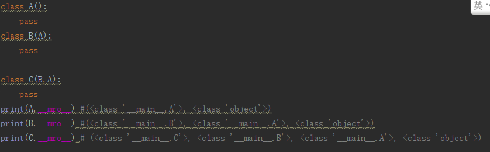

# OOP-Python 面向对象
- Python的面向对象
- 面向对象编程
  - 基础
  - 公有私有
  - 继承
  - 组合，Minxi
- 魔法函数
  - 魔法函数概述
  - 构造类魔法函数
  - 运算类魔法函数

# 1:面向对象概述
- OOP思想
  - 接触到任意一个任务，首先想到的是任务是这个世界的构成，是由模型构成的
- 几个名词
  - OO:面向对象
  - OOA：面向对象分析
  - OOD：面向对象设计
  - OOI：面向对象实现
  - OOP：面向对象编程
  - OOA -> OOD -> OOI ：面向对象的实现过程

- 类和对象的概念
  - 类：抽象名词，代表一个集合，共性的事物
  - 对象：具体的事物，单个个体
  - 类与对象的关系
    - 一个是具体的事物，代表一类事物的个体
    - 一个是抽象，代表一类事物
- 类中的事物，应该具有两个内容
  - 属性
  - 方法（函数）

# 2：类的基本实现
- 类的命名
  - 遵守变量名的规范
  - 大驼峰（多个单词构成，每个单词首字母大写）
  - 尽量避开跟系统命名相似的命名
- 如何声明一个类
  - 必须用class关键字
  - 类由属性和方法构成，其他不允许出现
  - 成员属性定义可以直接使用变量赋值，如果没有值，可以使用None
  - 案例 OOP_01.py
- 实例化类

          变量 = 类名（） # 实例化一个对象
- 访问对象成员
  - 使用 . 操作符

          obj.成员属性名称
          obj.成员方法
  - 可以通过默认内置变量检查类和对象的所有成员
    - 对象的所有成员检测

           # dict前后各有两个下划线
           obj._dict_
    - 类所有的成员

           # dict 前后各有两个下划线
# 3：补充anaconda
- anaconda主要是一个虚拟环境管理器
- 还是一个安装包管理器
- cmd :启动Anaconda Powershell Promat
- conda list:显示anaconda安装的包
- conda env list :显示anaconda的虚拟环境列表
- conda create -n xxx python=3.7 ：创建Python版本为3.7的anaconda虚拟环境
- conda  activate xxx ：激活创建的acaconda虚拟环境
- 
- conda deactivate
- 在Pycharm中切换虚拟环境:File -> Setting -> Project -> Project Interpreter -> add -> Conda Environment 选择已经存在的环境，教程是在Anaconda安装目录下的envs下面。
但是我的在这里

# 4：类与对象的成员分析
- 类和对象都可以存储成员，成员可以归类所有，也可以归对象所有
- 类存储成员时使用的是与类关联的一个对象。会有一个相应类对应的一个实例。
- 独享存储成员时存储在当前对象中。
- 对象访问一个成员的时候，如果对象中没有该成员，尝试访问类中的同名成员。如果对象中有此成员，则一定使用此成员
- 创建对象的时候，类中的成员不会放入对象当中，而是得到一个空对象，没有成员
- 通过对象对类中成员重新赋值或者通过对象添加成员时，对应成员会保存在对象中，而不会修改类成员

# 5：关于self
- self在对象的方法表示当前对象本身，如果通过对象调用一个方法，那么该对象会自动传入到当前方法的第一个参数中
- self并不是关键字，只是一个用于接受对象的普通参数，理论上可以使用任何一个普通变量名代替
- 方法中有self形参的方法称为非绑定类的方法，可以通过对象访问，没有self的是绑定类的方法，只能通过类来访问。
- 使用类访问绑定类的方法时候，如果类方法中需要访问当前类的成员，可以通过 __class__ 成员名来访问成员
# 6：面向对象三大特性
- 封装
- 继承
- 多态
## 6.1：封装
- 封装就是对对象的成员进行访问限制
- 封装的三个级别
  - 公开，public
  - 受保护的，protected
  - 私有的，private
  - public，private，protected 不是关键字
- 判别对象的位置
  - 对象内部
  - 对象外部
  - 子类中
- 私有
  - 私有成员时最高级别的封装，只有在当前类或者对象中访问
  - 在成员前面添加两个下划线即可

  - Python的私有不是真的私有，是一种成为name mangling的改名策略，可以使用对象名._classname_ attributename来访问
  
  
## 6.2：继承
- 继承就是一个类可以获得另外一个类中的成员属性和成员方法
- 作用：减少代码量，增加代码复用功能，同时可以设置类与类之间的关系
- 继承与被继承的概念：
  - 被继承的类叫做父类，也叫基类，也叫超类
  - 用于集成的类也叫子类，派生类
  - 继承与被继承一定存在一个 is - a 的关系
- 继承的语法（见代码）
```
class Person():
    name = "wyb"
    age = 0
    def sleep(self):
        print("Sleeping ....")

# 父类写在括号里面
class Teacher(Person):
    pass
t = Teacher()
print(t.name)  # 输出 ： wyb
```
- 继承的特征
  - 所有的类都继承自object两类，即所有的类都是object的类
  - 子类一旦继承父类，则可以使用父类中除私有成员外的所有内容，受保护的也可以
  - 子类继承父类后并没有将父类成员完全赋值到子类中，而是通过引用关系访问调用
  - 子类中可以定义独有的成员属性和方法
  - 子类中定义的成员和父类成员如果相同，则优先使用子类中的成员
  - 子类如果想扩充父类的方法，可以在定义新方法的同时访问父类成员来进行代码重用。可以使用 父类名.父类成员 的格式来调用父类成员，也可以使用super().父类成员的格式类调用。
```
  def work(self): #Person父类中存在work这个方法
  self.makeTest()    # 增加功能
  #扩充父类的功能只需要调用父类相同的函数
  Person.work(self)  # 方法1
  super().work()     # 方法2
```
- 继承变量函数的查找顺序问题
  - 任何情况都是优先查找自己
  - 没有则查找父类
  - 构造函数如果本类中没有定义，则自动查找调用父类构造函数
  - 如果本类中有定义，则不继续向上查找
- 构造函数
  - 什么是构造函数：是一种特殊的函数，在类进行实例化之前进行调用
```class Dog():
    # __init__ 就是构造函数
    # 每次实例化的时候，第一个被调用
    # 主要工作室进行初始化
    def __init__(self):
        print("构造函数")
kaka = Dog()
```
  - 实例化的时候，括号内的参数需要跟构造函数的参数匹配
  - 多个构造函数以及参数不同，调用的时候有区别的
```
  class PaxingAni(Animal):
    pass
    def __init__(self):
        print("爬行动物的构造函数")
    def __init__(self,name):  #构造函数含有参数
        print(name,"的构造函数")

    # 调用 e = ele("wyb")
```
  - 自己有构造函数就用自己的，没有就向上查找
  - 注意参数个数
- super
  - super不是关键字，而是一个类
  - 作用是获取MRO（MethodResalustionOrder）列表中的第一个类，往往是父类
  
  - super与父类没有直接关系，但是通过super可以调用到父类
  - super使用的两个方法
    - 在构造函数里面调用父类里面的构造函数
- 单继承和多继承
  - 单继承：每个类只能继承一个类
  - 多继承：每个类允许继承多个类（java不允许）
- 单继承和多继承的优缺点
  - 单继承：
    - 传承有序逻辑清晰语法简单隐患少呀
    - 功能不能无限拓展，只能在当前唯一的继承链中拓展
  - 多继承
    - 类的功能拓展方便
    - 继承关系混乱
    - 继承会使得子类变的巨大，牵一发而动全身
- 菱形继承/钻石继承的例子
  - 多个子类继承于同一个父类，这些子类又被同一个类继承，于是继承关系图形成一个菱形
  -   [关于MRO的文章]https://www.cnblogs.com/whatisfantasy/p/6046991.html
  - 关于多继承的MRO
    - MRO就是多继承中，用于保存继承顺序的一个列表
    - python本身采用C3算法完成多继承的菱形继承进行计算的结果
    - MRO列表的计算原则：
      - 子类永远在父类前面
      - 如果多个父类，则根据继承语法中括号内类的书写顺序存放
      - 如果多个类继承了同一个父类，孙子类只会选取继承语法括号中第一个父类的父类
      
## 6.3：多态
